# Potential 시스템 아키텍처

> 최종 갱신: 2026-05-13 (AMP/ADOT/Grafana 모니터링 도입 반영)
> 작성 범위: dev / prod 환경 모두

## 발표용 다이어그램 (AWS 공식 아이콘 PNG)

각 환경별로 1~2장의 다이어그램이 있습니다. 발표 슬라이드에 그대로 박아 쓰시면 됩니다.

### 운영 환경 (Prod)

**1) 요청 처리 흐름** — `docs/images/potential-prod-request.png`

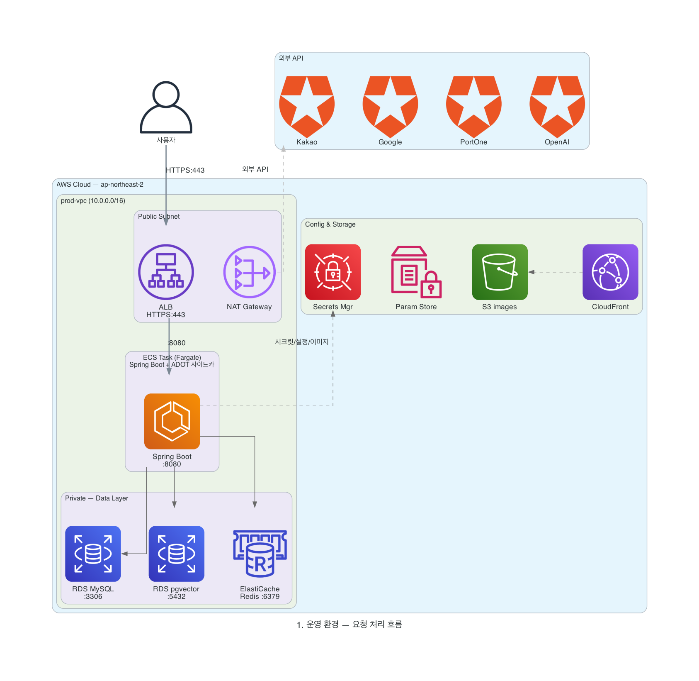

**2) 모니터링 흐름** — `docs/images/potential-prod-monitoring.png`

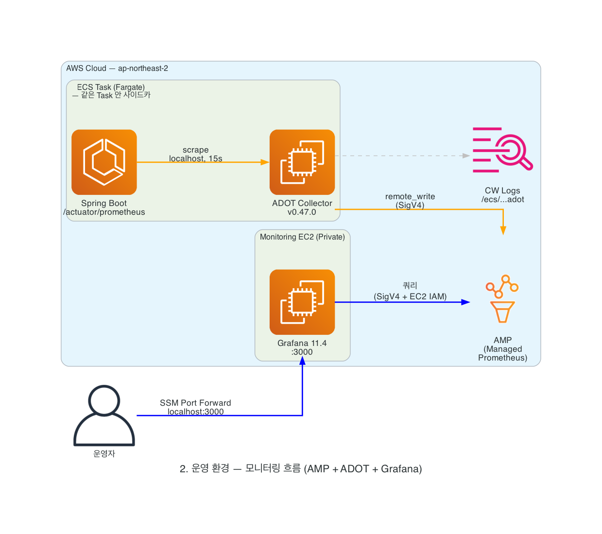

### 개발 환경 (Dev) — `docs/images/potential-dev.png`

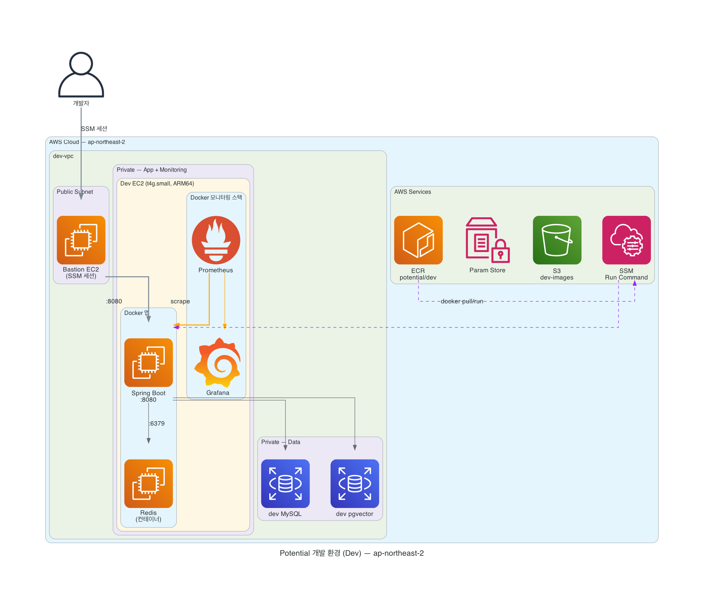

---

## 1. 전체 개요

```mermaid
flowchart LR
    User([👤 사용자])
    Frontend[프론트엔드<br/>www.potential-fourtential.shop]

    subgraph GH[GitHub]
      direction TB
      Repo[Four-tential/Potential]
      GHA[GitHub Actions]
    end

    subgraph AWS[AWS ap-northeast-2]
      direction TB
      subgraph PROD[운영 환경 — prod-vpc 10.0.0.0/16]
        ALB[Application Load Balancer<br/>HTTPS:443]
        ECS[ECS Fargate Task<br/>Spring Boot + ADOT 사이드카<br/>1 vCPU / 3GB]
        RDS_M[(RDS MySQL<br/>prod-potential-rds-mysql-1)]
        RDS_P[(RDS PostgreSQL + pgvector<br/>prod-potential-rds-postgre-1)]
        EC_R[ElastiCache Redis<br/>potential-prod-redis]
        ECR[ECR<br/>potential/prod]
        SM[Secrets Manager<br/>prod/rds/credentials]
        PS[Parameter Store<br/>/config/potential-prod/*]
        S3P[S3 + CloudFront<br/>potential-prod-images]
        AMP[(AMP 워크스페이스<br/>Managed Prometheus)]
        GRAF_EC2[Grafana EC2<br/>Private]
      end

      subgraph DEV[개발 환경]
        DEV_EC2[EC2<br/>Spring Boot + Redis + Monitoring]
        DEV_RDS[(dev RDS)]
      end
    end

    subgraph EXT[외부 서비스]
      KAKAO[카카오 OAuth2]
      GOOGLE[구글 OAuth2]
      PORTONE[PortOne 결제]
      OPENAI[OpenAI Embedding]
    end

    User --> Frontend
    Frontend -->|HTTPS| ALB
    ALB --> ECS
    ECS --> RDS_M
    ECS --> RDS_P
    ECS --> EC_R
    ECS --> S3P
    ECS -.->|OAuth/Pay/AI| KAKAO
    ECS -.-> GOOGLE
    ECS -.-> PORTONE
    ECS -.-> OPENAI
    ECS -->|시크릿 주입| SM
    ECS -->|설정 import| PS
    ECS -.->|메트릭 remote_write<br/>(ADOT 사이드카)| AMP
    GRAF_EC2 -.->|SigV4 쿼리| AMP

    Repo --> GHA
    GHA -->|prod-cd.yml<br/>main 브랜치| ECR
    GHA -->|dev-cd.yml<br/>dev 브랜치| DEV_EC2
    ECR --> ECS
```

---

## 2. 운영 환경 (Prod) 상세

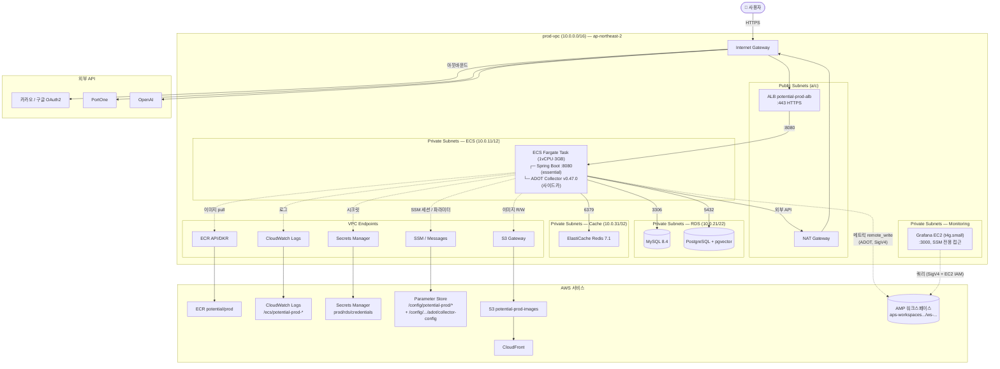

### 운영 환경 구성요소 요약

| 분류 | 리소스 | 사양 / 위치 | 비고 |
|---|---|---|---|
| **네트워크** | VPC `prod-vpc` | `10.0.0.0/16` | 6개 서브넷 (3 종류 × 2 AZ) |
| | NAT Gateway 1개 | Public Subnet-a | ECS → 외부 API 아웃바운드용 |
| | VPC Endpoints | Interface 6개 + Gateway 1개 | ECR / Logs / SSM / Secrets / S3 |
| **로드밸런서** | ALB `potential-prod-alb` | HTTPS:443, ACM 인증서 | Listener Rules 3개 (Actuator 차단 포함) |
| | Target Group | path `/actuator/health`, port 8080 | grace 300s |
| **컴퓨트** | ECS Cluster `potential-prod-ecs-cluster` | Fargate | 단일 service / 1 task |
| | ECS Service `potential-prod-ecs-service` | Rolling, 100% min / 200% max | Circuit breaker + rollback |
| | Task Definition (rev:10+) | 1 vCPU / 3GB, X86_64 | 컨테이너 2개: Spring Boot + ADOT 사이드카 |
| | ADOT Sidecar | `:v0.47.0`, `memoryReservation: 128MB` | `essential: false` (앱 영향 격리), Prometheus scrape → AMP remote_write |
| **데이터** | RDS MySQL `prod-potential-rds-mysql-1` | 8.4 (확인 필요) | 자동 백업 7일 |
| | RDS PostgreSQL `prod-potential-rds-postgre-1` | pgvector extension | 임베딩 저장 |
| | ElastiCache Redis `potential-prod-redis` | 7.1, cache.t4g.micro 단일 노드 | TLS off, AUTH off (10일 운영) |
| **자격증명/설정** | Secrets Manager | `prod/rds/credentials` 1개 (JSON 8키) | DB/pgvector 자격증명 |
| | Parameter Store | `/config/potential-prod/*` 약 20개 | OAuth/JWT/PortOne/Redis 등 |
| **저장소** | ECR `potential/prod` | Lifecycle: untagged 7일, 최근 10개 | |
| | S3 `potential-prod-images` | 이미지 저장 | CloudFront 캐싱 |
| **모니터링** | CloudWatch Logs `/ecs/potential-prod-ecs-task-definition` | retention 30일 | 앱/ADOT 로그 분리 prefix |
| | Container Insights | 활성 | 클러스터/태스크 CPU·메모리 |
| | AMP (Managed Prometheus) | `ws-0e10d9e2-...` 워크스페이스 | ADOT remote_write 수신 |
| | Grafana EC2 | t4g.small, Private | docker grafana/grafana:11.4.0, SSM port forward (3000) 전용 |
| | 대시보드 | "Potential Prod Overview" (`/d/potential-prod`) | 8 panel: Up/HTTP rate/p95/JVM/CPU/HikariCP |

---

## 3. 개발 환경 (Dev) 상세

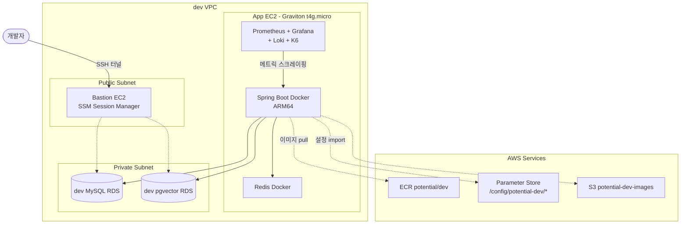

### Dev vs Prod 핵심 차이

| 항목 | Dev | Prod |
|---|---|---|
| 컴퓨트 | EC2 + Docker | ECS Fargate |
| 아키텍처 | ARM64 (Graviton) | X86_64 |
| 배포 방식 | SSM Run Command (`docker pull && run`) | ECS Service Rolling |
| Redis | EC2 위 Docker | ElastiCache (단일 노드) |
| 모니터링 | docker-compose (Prom/Grafana/Loki/K6) | CloudWatch만 (Container Insights 미활성) |
| 시크릿 | Parameter Store | Secrets Manager + Parameter Store 하이브리드 |
| ALB | 없음 (Bastion 직접) | ALB + ACM HTTPS |
| 비용 | 매우 낮음 | 일 ~$8 추정 |

---

## 4. CI/CD 파이프라인

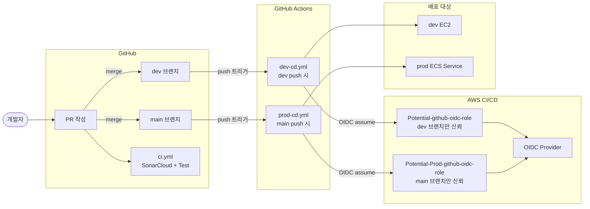

### CI/CD 흐름 단계

#### prod-cd.yml (main 브랜치)
1. **Checkout** → 소스 가져옴
2. **JDK 21 + Gradle 캐시** → 의존성 캐싱
3. **`./gradlew bootJar -x test`** → JAR 빌드 (테스트는 CI에서 별도)
4. **AWS OIDC 인증** → `Potential-Prod-github-oidc-role` assume
5. **ECR push** (linux/amd64) → `potential/prod:<commit-sha>`
6. **infra/taskdef.json 렌더링** → `<ACCOUNT_ID>` / `<IMAGE_URI>` 치환
7. **`aws ecs register-task-definition`** → 새 리비전 등록
8. **`aws ecs update-service`** → `--health-check-grace-period-seconds 300 --force-new-deployment`
9. **`aws ecs wait services-stable`** → 최대 25분 대기 (Spring Boot 콜드 스타트 여유)
10. **서비스 이벤트 출력** → 성공/실패 흔적

#### dev-cd.yml (dev 브랜치)
1. 빌드 → ECR push (linux/arm64, dev 리포)
2. AWS SSM Run Command로 EC2에 `docker pull && docker run`
3. EC2에서 컨테이너 헬스체크

### IAM 권한 분리 (환경별)

| 역할 / 정책 | 환경 | 권한 |
|---|---|---|
| `Potential-github-oidc-role` | dev | `Potential-Dev-GHA-ECR-Push` + `Potential-Dev-GHA-SSM-Deploy` |
| `Potential-Prod-github-oidc-role` | prod | `Potential-Prod-GHA-ECR-Push` + `Potential-Prod-GHA-ECS-Deploy` |
| `ecsTaskExecutionRole` | 인프라 | ECR pull, Logs, SSM Params, Secrets Manager + KMS Decrypt |
| `ECS-role-task-S3` (Task Role) | 앱 코드 | S3 R/W, Parameter Store at runtime |

---

## 5. 보안 계층

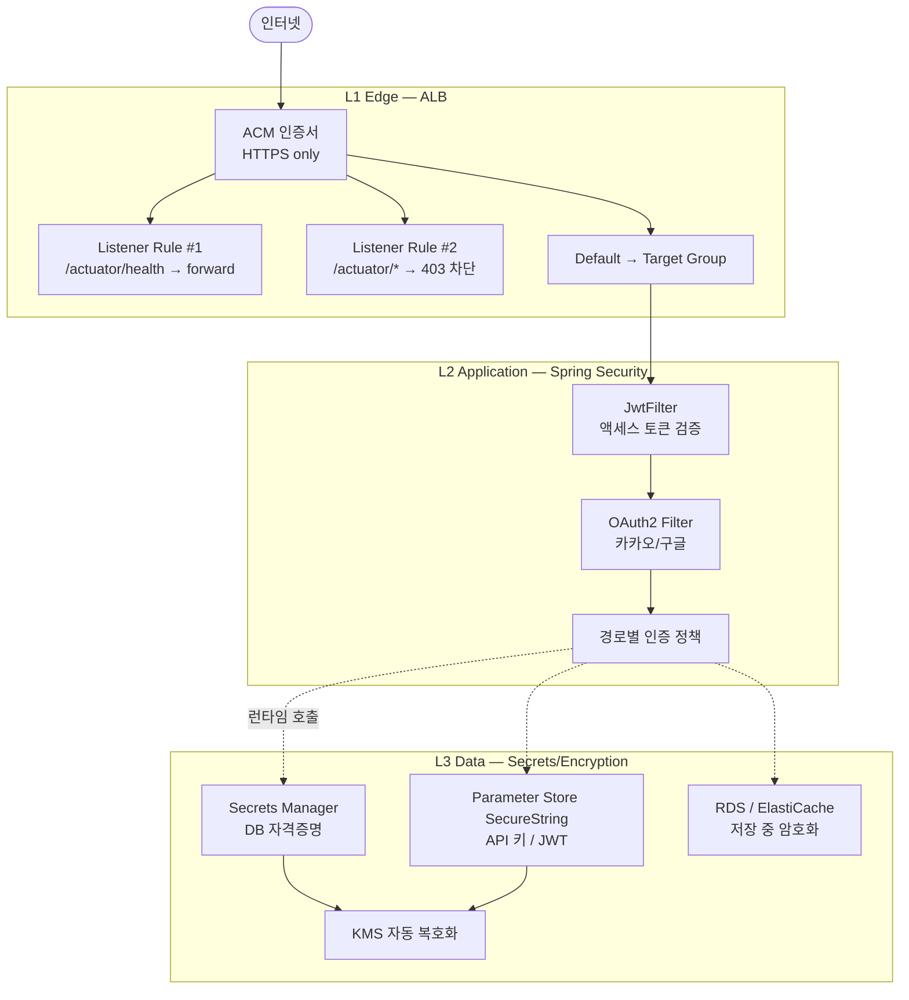

### 보안 체크포인트

| 계층 | 적용 사항 |
|---|---|
| **네트워크** | ECS / RDS / Redis 모두 private subnet. ALB만 public exposure. |
| **SG 최소권한** | ALB → ECS:8080 / ECS → RDS:3306 / ECS → pgvector:5432 / ECS → Redis:6379 / ECS → VPCE:443 |
| **TLS** | ALB ↔ Client 강제 HTTPS (ACM). RDS/Redis는 VPC 내부라 평문 (별도 PR 검토 중) |
| **인증** | JWT(15분 access + 7일 refresh) + OAuth2 PKCE. Refresh token은 HttpOnly cookie |
| **시크릿 관리** | DB 자격증명은 Secrets Manager, 그 외 SecureString. KMS로 자동 복호화 |
| **Actuator 노출 차단** | ALB Listener Rule로 `/actuator/*` → 403 (prometheus / info 외부 차단) |
| **CI/CD** | OIDC short-lived token. 브랜치별 sub 조건 잠금 (dev / main만 신뢰) |
| **IAM 스코핑** | 모든 정책 Resource ARN으로 좁힘 (prod ECR / prod cluster / prod 시크릿) |

---

## 6. 데이터 흐름 (대표 시나리오)

### 6-1. 일반 API 호출 (로그인 후)

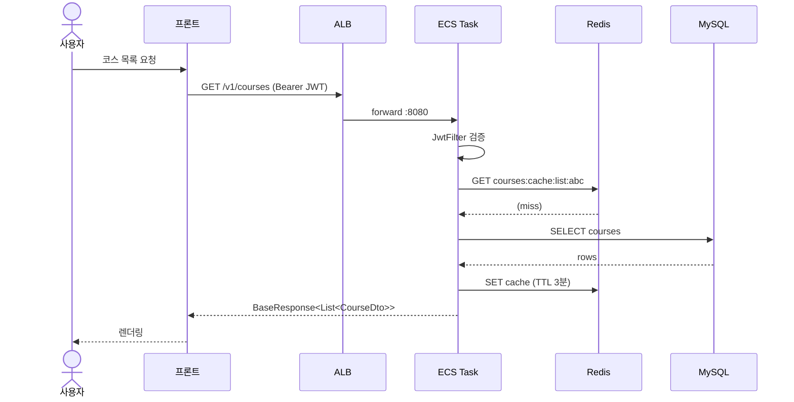

### 6-2. 카카오 소셜 로그인

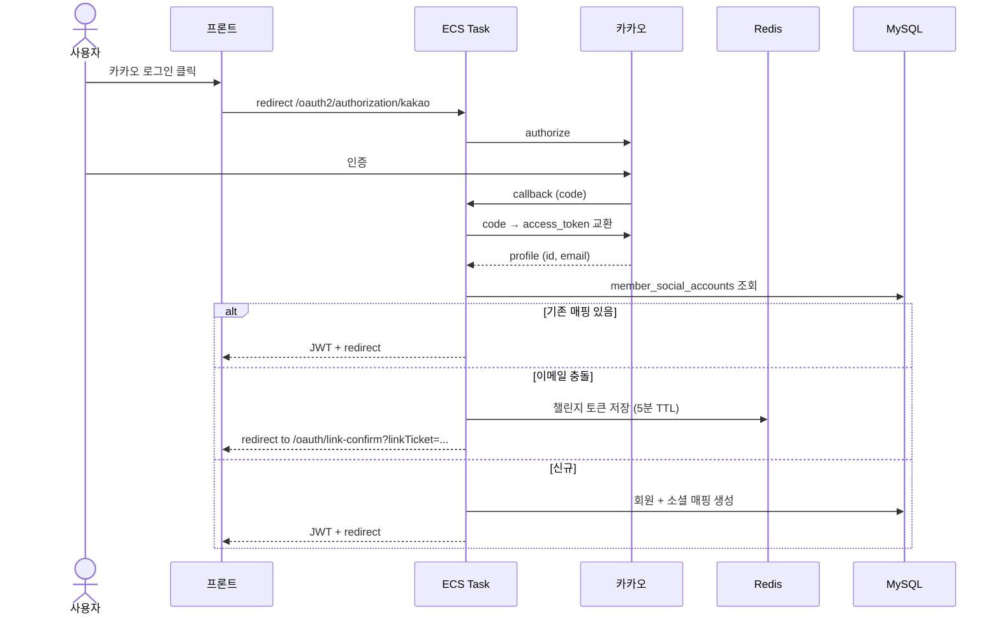

### 6-3. 운영 배포 (main 머지 시)

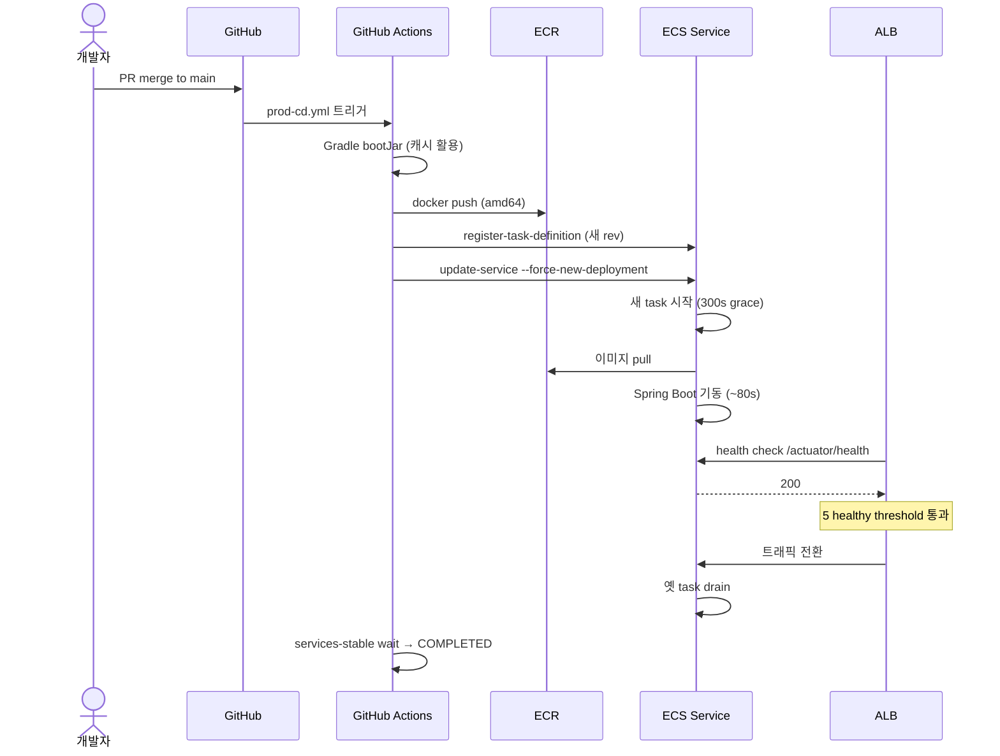

---

## 7. 비용 구성 (대략)

| 항목 | 월 비용 (USD) | 비고 |
|---|---|---|
| NAT Gateway | ~$32 | 시간당 $0.045 |
| VPC Endpoint Interface 6개 × 2 AZ | ~$170 | 시간당 $0.013 × 12 |
| RDS (prod MySQL + pgvector) | ~$26 | db.t4g.micro × 2 |
| ECS Fargate (1 vCPU / 3GB) | ~$30 | 시간당 $0.0418 |
| ElastiCache (cache.t4g.micro 단일 노드) | ~$13 | |
| ALB | ~$16 | 시간당 $0.0225 |
| Secrets Manager | ~$0.40 | 시크릿 1개 |
| Parameter Store SecureString | ~$0 | 표준은 무료 |
| ECR (스토리지) | <$1 | Lifecycle 자동 정리 |
| CloudWatch Logs | <$1 | retention 30일 |
| S3 + CloudFront | <$1 | 이미지 트래픽 |
| **모니터링** | | |
| AMP (Managed Prometheus) | ~$3-5 | 메트릭 샘플 단위 과금, 데모 트래픽 기준 |
| Grafana EC2 (t4g.small) | ~$12 | 데모 기간만 운영, 종료 시 stop |
| **합계** | **~$305-310/월** | NAT/VPCE가 절반 이상 차지 |

### 비용 최적화 후보 (트래픽 작을 때)
- ⚡ VPC Endpoints 1 AZ로 축소 → 월 $85 절감
- ⚡ NAT Gateway 제거 + ECS public subnet 배치 → 월 $32 절감
- ⚡ RDS pgvector 통합 → 월 $13 절감
- 단, 보안/HA trade-off

---

## 8. 트래킹 중인 항목

| 우선순위 | 항목 | 비고 |
|---|---|---|
| 🔴 보안 | sessionStorage → HttpOnly cookie 전환 | XSS 방어 강화 |
| 🔴 보안 | MySQL `sslMode=REQUIRED` 적용 | RDS TLS 인증서 검증 후 |
| 🔴 보안 | Actuator `management.server.port` 분리 | 1차 ALB rule 차단 후 정밀화 |
| 🟡 UX | 회원가입 자동 로그인 (signup 응답에 토큰) | Issue #132 |
| 🟡 UX | `window.prompt` → 모달 컴포넌트 | 공용 컴포넌트 도입 |
| 🟢 검색 | 검색 Tier 1 패키지 (`docs/SEARCH_IMPROVEMENT_PLAN.md`) | 다음주 예정 |
| 🟢 운영 | CloudWatch 알람 (ECS/ALB/RDS/Redis) | Container Insights는 활성, 알람만 미적용 |
| 🟢 운영 | ECS Service Auto Scaling | 트래픽 증가 대비 |
| 🟢 운영 | Grafana 대시보드 → 정식 운영자 계정 분리 | 현재 admin 단일 계정. IAM Identity Center 도입 검토 |
| 🟢 권한 | CloudWatchLogsFullAccess → 좁힌 정책 그룹 교체 | 별도 PR (다른 팀원 영향) |
| 🟢 권한 | `github-action-potential-dev-user` 폐기 | OIDC 전환 완료 |

---

## 9. 운영 모니터링 (AMP + ADOT + Grafana)


### 9-1. 데이터 흐름

#### 아이콘 다이어그램 (architecture-beta)

```mermaid
architecture-beta
    group prod(cloud)[Prod VPC]
    group monitoring(cloud)[Monitoring]

    service app(logos:spring)[Spring Boot] in prod
    service adot(logos:aws-cloudwatch)[ADOT Sidecar] in prod
    service amp(logos:aws-prometheus)[AMP] in monitoring
    service grafana(logos:grafana)[Grafana EC2] in monitoring
    service operator(logos:linux-tux)[Operator]

    app:R --> L:adot
    adot:R --> L:amp
    grafana:B --> T:amp
    operator:R --> L:grafana
```

#### 텍스트 플로우 다이어그램

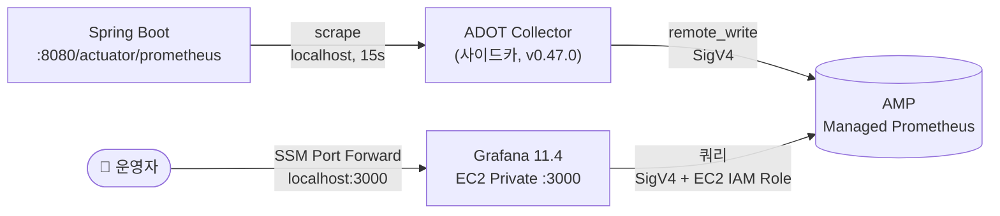

### 9-2. 핵심 구성 요소

| 구성 | 어디서 / 어떻게 | 비고 |
|---|---|---|
| **Spring Boot Actuator** | 앱 컨테이너 내부 `:8080/actuator/prometheus` | Micrometer 자동 노출 |
| **ADOT Collector (사이드카)** | ECS Task 안 같은 네트워크 | `:v0.47.0` 핀, `memoryReservation: 128MB`, `essential: false` |
| **ADOT 설정** | SSM Parameter Store `/config/potential-prod/adot/collector-config` | Prometheus receiver + prometheusremotewrite exporter (sigv4auth) |
| **AMP 워크스페이스** | `ws-0e10d9e2-4927-41b1-a32e-0352ae1ea7b6` | Managed Prometheus, 9 region 중 서울 (ap-northeast-2) |
| **AMP IAM (쓰기)** | ECS Task Role `ECS-role-task-S3` | `aps:RemoteWrite` |
| **AMP IAM (읽기)** | EC2 Instance Profile `Potential-Monitoring-EC2-Role` 인라인 정책 `AmpQuery` | `aps:QueryMetrics/GetLabels/GetSeries/GetMetricMetadata` |
| **Grafana** | `i-00fbb5ea475c7600b` (Private EC2, t4g.small) | docker `grafana/grafana:11.4.0` |
| **Grafana 환경 변수** | 컨테이너 env | `GF_AUTH_SIGV4_AUTH_ENABLED=true`, `GF_AWS_AUTH_PROVIDERS=default` |
| **Grafana 데이터소스** | Provisioning yaml | `sigV4Auth: true`, `sigV4AuthType: default`, `httpMethod: POST` |

### 9-3. Grafana 접속 (운영자 / 데모 시연용)

새 터미널에서:

```bash
aws ssm start-session \
  --region ap-northeast-2 \
  --target i-00fbb5ea475c7600b \
  --document-name AWS-StartPortForwardingSession \
  --parameters '{"portNumber":["3000"],"localPortNumber":["3000"]}'
```

브라우저: <http://localhost:3000>

| 항목 | 값 |
|---|---|
| ID | `admin` |
| 비밀번호 | `PotentialAdmin2026` |
| 기본 대시보드 | "Potential Prod Overview" (`/d/potential-prod`) |

### 9-4. 대시보드 패널 (8종)

| # | 패널 | 의미 |
|---|---|---|
| 1 | Service Up | 앱 살아있는지 (1=UP/0=DOWN) |
| 2 | HTTP Request Rate (URI별) | 초당 요청 수 |
| 3 | HTTP Status Codes | 응답 코드 분포 (5xx 솟으면 장애) |
| 4 | JVM Heap Usage | 메모리 used vs max |
| 5 | HTTP p95 Latency | 95% 사용자 응답 시간 |
| 6 | JVM Threads | 라이브 스레드 수 |
| 7 | Process CPU Usage | 컨테이너 CPU 사용률 |
| 8 | HikariCP Active Connections | DB 커넥션 풀 |

### 9-5. 자주 쓰는 PromQL

```promql
# 5xx 비율
sum(rate(http_server_requests_seconds_count{status=~"5.."}[5m]))
  / sum(rate(http_server_requests_seconds_count[5m]))

# URI별 p95 응답 시간
histogram_quantile(0.95, sum(rate(http_server_requests_seconds_bucket[5m])) by (le, uri))

# JVM heap 사용량
sum(jvm_memory_used_bytes{area="heap"})

# HikariCP 사용/대기
hikaricp_connections_active
hikaricp_connections_pending
```

### 9-6. 추가로 살아있는 CloudWatch 모니터링

AMP/Grafana와 별개로 CloudWatch 기반 모니터링도 계속 운영됩니다.

| 구성 | 비고 |
|---|---|
| **ECS Container Insights** | 클러스터/태스크 CPU·메모리 (~$3/월) |
| **CloudWatch Dashboard `Potential-Prod-Overview`** | 13개 위젯 (ALB/RDS/Redis 등) |
| **CloudWatch Logs** | 30일 retention, 앱/ADOT 로그 분리 prefix |

### 9-7. 데모 시연 흐름 (권장)

```
1. 아키텍처 다이어그램 설명
   - docs/images/potential-architecture.png  → 전체 시스템
   - docs/images/potential-monitoring.png    → 모니터링 흐름
2. 사이트 접속 (https://www.potential-fourtential.shop)
3. Grafana 대시보드 열기 (SSM Port Forward → localhost:3000)
4. 라이브 메트릭 시연
   - 다른 터미널에서 트래픽 발생
     curl https://www.potential-fourtential.shop/actuator/health
   - 30~60초 후 HTTP Request Rate 봉우리 확인
5. (선택) CloudWatch Dashboard 진입 → 인프라 메트릭 보완
```

### 9-8. 알람 (예정 — 별도 PR)

| 메트릭 | 임계값 | 통보 |
|---|---|---|
| ECS Running Task < Desired | 1분 이상 | Slack/이메일 |
| ALB 5xx > 5/분 | 5분 평균 | Slack |
| RDS CPU > 80% | 5분 평균 | Slack |
| Redis Memory > 80% | 5분 평균 | Slack |
| Grafana → AMP 헬스체크 실패 | 5분 | Slack |

---

## 10. 관련 문서

- [docs/DEMO_OPS_MANUAL.md](./DEMO_OPS_MANUAL.md) — **데모/발표 운영 매뉴얼** (접속·명령어·정리 가이드)
- [docs/images/potential-prod-request.png](./images/potential-prod-request.png) — 운영 요청 처리 흐름
- [docs/images/potential-prod-monitoring.png](./images/potential-prod-monitoring.png) — 운영 모니터링 흐름
- [docs/images/potential-dev.png](./images/potential-dev.png) — 개발 환경
- [docs/SEARCH_IMPROVEMENT_PLAN.md](./SEARCH_IMPROVEMENT_PLAN.md) — 검색 고도화 계획
- [docs/FEATURES.md](./FEATURES.md) — 기능 명세
- [docs/FLOWS.md](./FLOWS.md) — 비즈니스 플로우
- [운영 서버 배포 구축 Cookbook (노션)](https://kyjtheyj.notion.site/Cookbook-5092d60f484383deaaff81706569d75c)
