# Potential — 시스템 플로우차트 (전 도메인)

회원·인증·소셜·코스·주문·결제·환불·출석·후기·챗봇·배치까지 시스템의 모든 흐름을 시각화한 문서입니다. 모든 다이어그램은 Mermaid로 작성되어 있어 노션·GitHub·옵시디언에서 그대로 렌더링됩니다.

## 목차

1. [전체 사용자 여정](#1-전체-사용자-여정)
2. [도메인 의존 관계도](#2-도메인-의존-관계도)
3. [회원 상태 머신](#3-회원-상태-머신)
4. [코스 상태 머신](#4-코스-상태-머신)
5. [주문 상태 머신](#5-주문-상태-머신)
6. [결제 상태 머신](#6-결제-상태-머신)
7. [인증 토큰 흐름](#7-인증-토큰-흐름-jwt--refresh)
8. [소셜 로그인 + 이메일 충돌](#8-소셜-로그인--이메일-충돌-자동-연동)
9. [강사 전환 신청](#9-강사-전환-신청)
10. [주문 생성 + 대기열](#10-주문-생성--대기열)
11. [결제 + PortOne 웹훅](#11-결제--portone-웹훅)
12. [환불 — 수강생 직접 신청](#12-환불--수강생-직접-신청)
13. [환불 — 강사 코스 취소 자동 환불 (Outbox + Batch)](#13-환불--강사-코스-취소-자동-환불-outbox--batch)
14. [출석 — QR 생성·스캔·SSE](#14-출석--qr-생성스캔sse)
15. [후기 + AI 요약](#15-후기--ai-요약)
16. [챗봇 RAG (적재 + 질의)](#16-챗봇-rag-적재--질의)
17. [시스템 스케줄러 요약](#17-시스템-스케줄러-요약)

---

## 1. 전체 사용자 여정

가입부터 후기 작성까지 한 명의 사용자가 시스템을 통과하는 큰 흐름입니다.

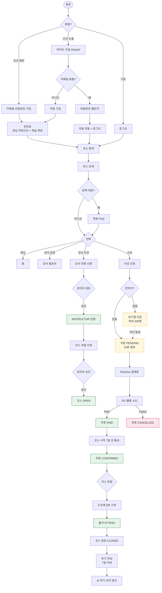
```mermaid
flowchart TD
    Start([방문]) --> AuthGate{회원?}

    AuthGate -->|신규 일반| Signup[이메일·비밀번호 가입]
    AuthGate -->|신규 소셜| OAuth[카카오·구글 OAuth2]
    AuthGate -->|기존| Login[로그인]

    OAuth --> Conflict{이메일 충돌?}
    Conflict -->|아니오| AutoSignup[자동 가입]
    Conflict -->|예| Challenge[비밀번호 챌린지]
    Challenge --> AutoLink[자동 연동 + 로그인]

    Signup --> Onboarding[온보딩<br/>관심 카테고리 + 학습 목표]
    AutoSignup --> Onboarding
    Onboarding --> Browse
    AutoLink --> Browse
    Login --> Browse

    Browse[코스 탐색] --> Detail[코스 상세]
    Detail --> ChatHelp{정책 의문?}
    ChatHelp -->|예| Chatbot[챗봇 FAQ]
    ChatHelp -->|아니오| Pick{선택}
    Chatbot --> Pick

    Pick -->|관심| Wishlist[찜]
    Pick -->|강사 호감| Follow[강사 팔로우]
    Pick -->|강사 도전| ApplyInst[강사 전환 신청]
    Pick -->|수강| Order[수강 신청]

    ApplyInst --> AdminA{관리자 검토}
    AdminA -->|승인| BeInstructor[INSTRUCTOR 전환]
    BeInstructor --> CreateCourse[코스 개설 신청]
    CreateCourse --> AdminC{관리자 승인}
    AdminC -->|승인| CourseOpen[코스 OPEN]

    Order --> SeatCheck{잔여석?}
    SeatCheck -->|있음| Pending[주문 PENDING<br/>10분 점유]
    SeatCheck -->|없음| Wait[대기열 진입<br/>최대 200명]
    Wait -. 자리 발생 .-> Pending

    Pending --> Pay[PortOne 결제창]
    Pay --> Webhook[PG 웹훅 수신]
    Webhook -->|Paid| Paid[주문 PAID]
    Webhook -->|Failed| Cancelled[주문 CANCELLED]

    Paid --> Wait7d[코스 시작 7일 전 통과]
    Wait7d --> Confirmed[주문 CONFIRMED]

    Confirmed --> StartDay{코스 당일}
    StartDay --> QRScan[수강생 QR 스캔]
    QRScan --> Attended[출석 ATTEND]

    Attended --> CourseEnd[코스 종료 CLOSED]
    CourseEnd --> Review[후기 작성<br/>7일 이내]
    Review --> Summary[AI 후기 요약 갱신]

    classDef success fill:#e6f4ea,stroke:#137333
    classDef hold fill:#fff8e1,stroke:#f9a825
    classDef terminal fill:#fce4ec,stroke:#c2185b
    class Paid,Confirmed,Attended,CourseOpen,BeInstructor success
    class Pending,Wait hold
    class Cancelled terminal
```

---

## 2. 도메인 의존 관계도

각 도메인이 어떤 인프라/외부 서비스를 쓰는지, 도메인 간 의존이 어디로 흐르는지 표현했습니다.

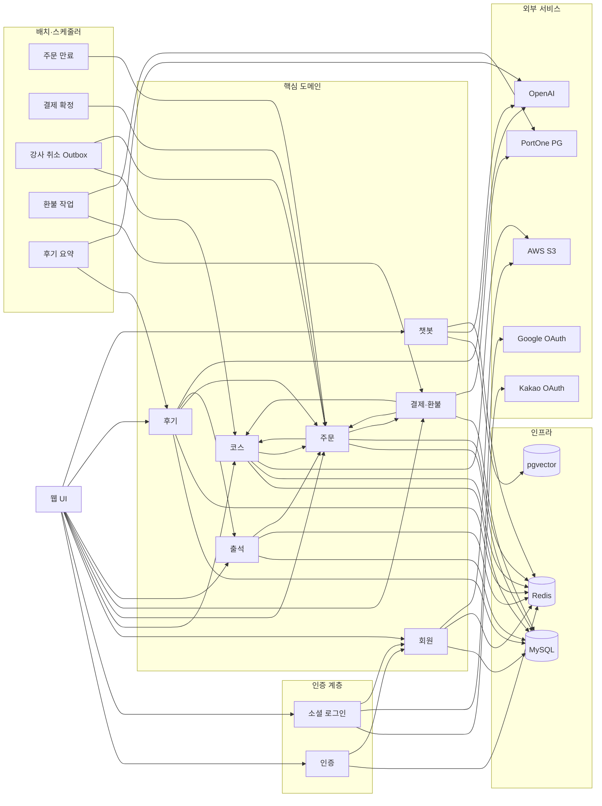
```mermaid
flowchart LR
    UI[웹 UI]

    subgraph Auth [인증 계층]
        AuthD[인증]
        Social[소셜 로그인]
    end

    subgraph Core [핵심 도메인]
        Member[회원]
        Course[코스]
        Order[주문]
        Payment[결제·환불]
        Attendance[출석]
        Review[후기]
        Chatbot[챗봇]
    end

    subgraph Batch [배치·스케줄러]
        OrderExp[주문 만료]
        OrderConf[결제 확정]
        InstCancel[강사 취소 Outbox]
        RefundJob[환불 작업]
        ReviewSum[후기 요약]
    end

    subgraph Infra [인프라]
        MySQL[(MySQL)]
        Redis[(Redis)]
        PgVector[(pgvector)]
    end

    subgraph External [외부 서비스]
        Kakao[Kakao OAuth]
        Google[Google OAuth]
        PortOne[PortOne PG]
        OpenAI[OpenAI]
        S3[AWS S3]
    end

    UI --> AuthD
    UI --> Social
    UI --> Member
    UI --> Course
    UI --> Order
    UI --> Payment
    UI --> Attendance
    UI --> Review
    UI --> Chatbot

    Social --> Kakao
    Social --> Google
    Social --> Member

    AuthD --> Redis
    AuthD --> Member

    Member --> MySQL
    Member --> Redis
    Member --> S3

    Course --> MySQL
    Course --> Redis
    Course --> S3
    Course --> Order

    Order --> MySQL
    Order --> Redis
    Order --> Course
    Order --> Payment

    Payment --> MySQL
    Payment --> PortOne
    Payment --> Order
    Payment --> Course

    Attendance --> MySQL
    Attendance --> Redis
    Attendance --> Order

    Review --> MySQL
    Review --> Redis
    Review --> Order
    Review --> Attendance
    Review --> OpenAI

    Chatbot --> PgVector
    Chatbot --> OpenAI
    Chatbot --> Redis

    OrderExp --> Order
    OrderConf --> Order
    InstCancel --> Course
    InstCancel --> Order
    RefundJob --> Payment
    RefundJob --> PortOne
    ReviewSum --> Review
    ReviewSum --> OpenAI
```

---

## 3. 회원 상태 머신

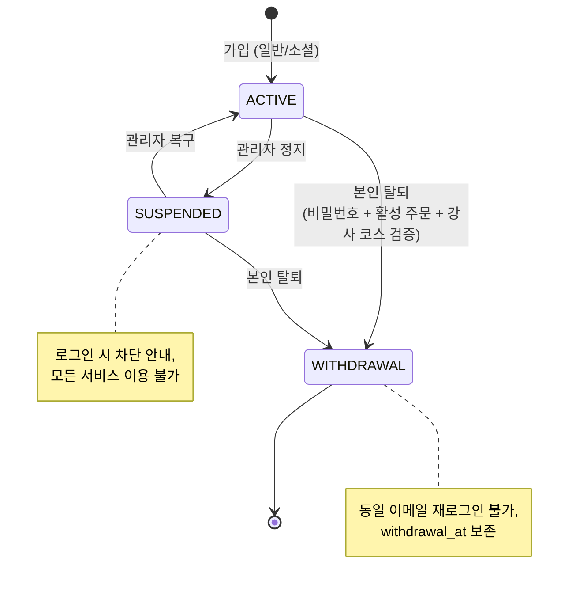
```mermaid
stateDiagram-v2
    [*] --> ACTIVE: 가입 (일반/소셜)
    ACTIVE --> SUSPENDED: 관리자 정지
    SUSPENDED --> ACTIVE: 관리자 복구
    ACTIVE --> WITHDRAWAL: 본인 탈퇴<br/>(비밀번호 + 활성 주문 + 강사 코스 검증)
    SUSPENDED --> WITHDRAWAL: 본인 탈퇴
    WITHDRAWAL --> [*]

    note right of SUSPENDED
        로그인 시 차단 안내,
        모든 서비스 이용 불가
    end note

    note right of WITHDRAWAL
        동일 이메일 재로그인 불가,
        withdrawal_at 보존
    end note
```

---

## 4. 코스 상태 머신

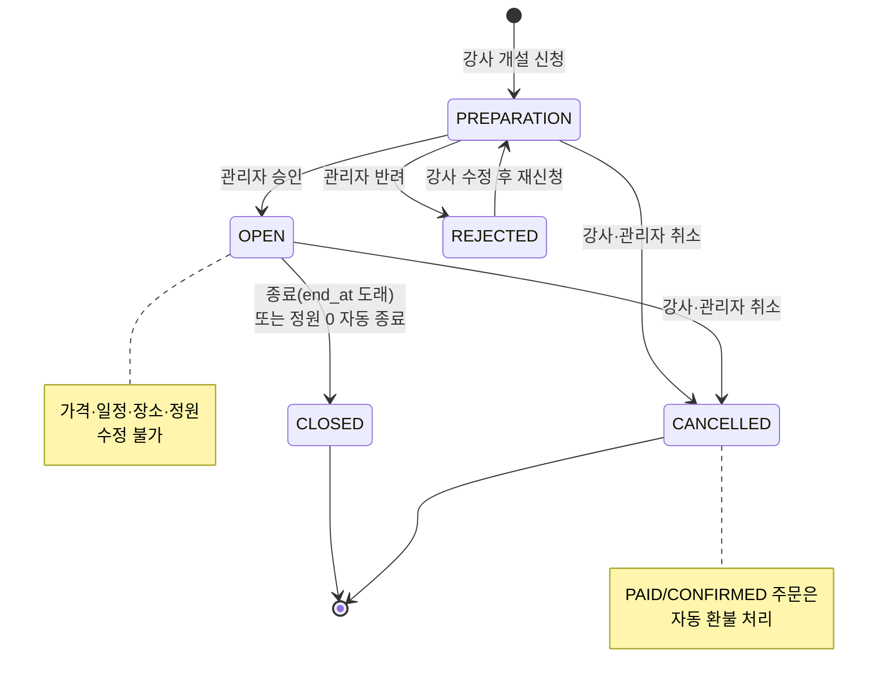
```mermaid
stateDiagram-v2
    [*] --> PREPARATION: 강사 개설 신청
    PREPARATION --> OPEN: 관리자 승인
    PREPARATION --> REJECTED: 관리자 반려
    PREPARATION --> CANCELLED: 강사·관리자 취소
    REJECTED --> PREPARATION: 강사 수정 후 재신청
    OPEN --> CLOSED: 종료(end_at 도래)<br/>또는 정원 0 자동 종료
    OPEN --> CANCELLED: 강사·관리자 취소
    CLOSED --> [*]
    CANCELLED --> [*]

    note right of OPEN
        가격·일정·장소·정원
        수정 불가
    end note
    note right of CANCELLED
        PAID/CONFIRMED 주문은
        자동 환불 처리
    end note
```

---

## 5. 주문 상태 머신

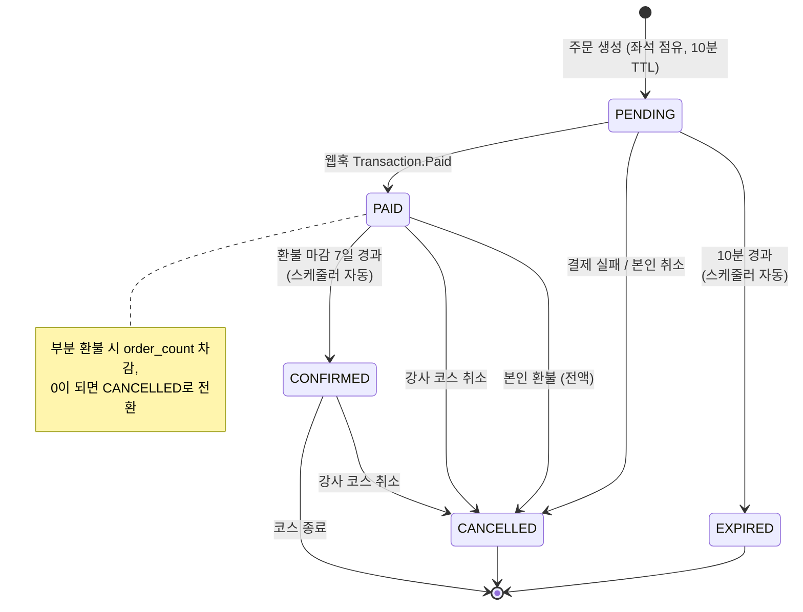
```mermaid
stateDiagram-v2
    [*] --> PENDING: 주문 생성 (좌석 점유, 10분 TTL)

    PENDING --> PAID: 웹훅 Transaction.Paid
    PENDING --> EXPIRED: 10분 경과<br/>(스케줄러 자동)
    PENDING --> CANCELLED: 결제 실패 / 본인 취소

    PAID --> CONFIRMED: 환불 마감 7일 경과<br/>(스케줄러 자동)
    PAID --> CANCELLED: 본인 환불 (전액)
    PAID --> CANCELLED: 강사 코스 취소

    CONFIRMED --> CANCELLED: 강사 코스 취소

    EXPIRED --> [*]
    CANCELLED --> [*]
    CONFIRMED --> [*]: 코스 종료

    note right of PAID
        부분 환불 시 order_count 차감,
        0이 되면 CANCELLED로 전환
    end note
```

---

## 6. 결제 상태 머신

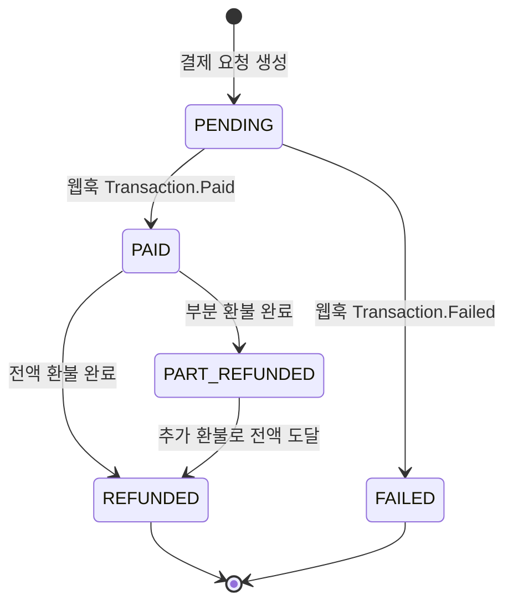
```mermaid
stateDiagram-v2
    [*] --> PENDING: 결제 요청 생성
    PENDING --> PAID: 웹훅 Transaction.Paid
    PENDING --> FAILED: 웹훅 Transaction.Failed
    PAID --> PART_REFUNDED: 부분 환불 완료
    PAID --> REFUNDED: 전액 환불 완료
    PART_REFUNDED --> REFUNDED: 추가 환불로 전액 도달
    REFUNDED --> [*]
    FAILED --> [*]
```

---

## 7. 인증 토큰 흐름 (JWT + Refresh)

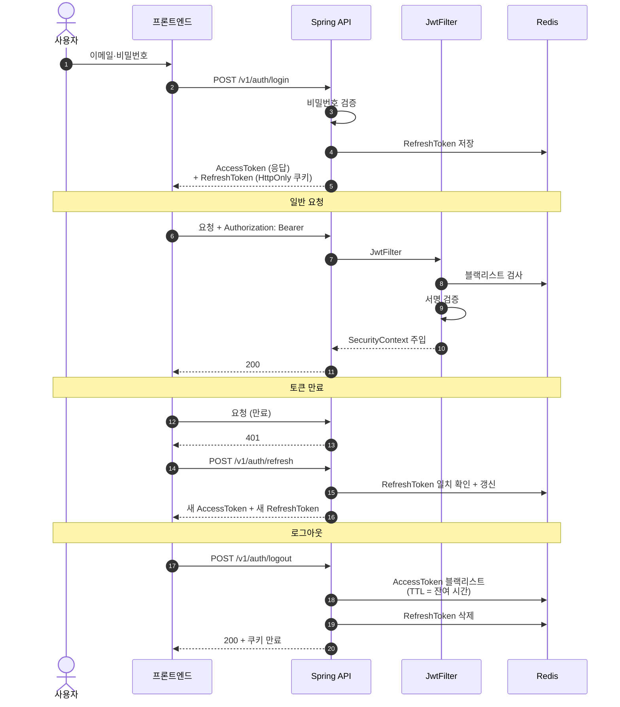
```mermaid
sequenceDiagram
    autonumber
    actor U as 사용자
    participant FE as 프론트엔드
    participant API as Spring API
    participant Filter as JwtFilter
    participant Redis as Redis

    U->>FE: 이메일·비밀번호
    FE->>API: POST /v1/auth/login
    API->>API: 비밀번호 검증
    API->>Redis: RefreshToken 저장
    API-->>FE: AccessToken (응답)<br/>+ RefreshToken (HttpOnly 쿠키)

    Note over U,Redis: 일반 요청
    FE->>API: 요청 + Authorization: Bearer
    API->>Filter: JwtFilter
    Filter->>Redis: 블랙리스트 검사
    Filter->>Filter: 서명 검증
    Filter-->>API: SecurityContext 주입
    API-->>FE: 200

    Note over U,Redis: 토큰 만료
    FE->>API: 요청 (만료)
    API-->>FE: 401
    FE->>API: POST /v1/auth/refresh
    API->>Redis: RefreshToken 일치 확인 + 갱신
    API-->>FE: 새 AccessToken + 새 RefreshToken

    Note over U,Redis: 로그아웃
    FE->>API: POST /v1/auth/logout
    API->>Redis: AccessToken 블랙리스트<br/>(TTL = 잔여 시간)
    API->>Redis: RefreshToken 삭제
    API-->>FE: 200 + 쿠키 만료
```

---

## 8. 소셜 로그인 + 이메일 충돌 자동 연동

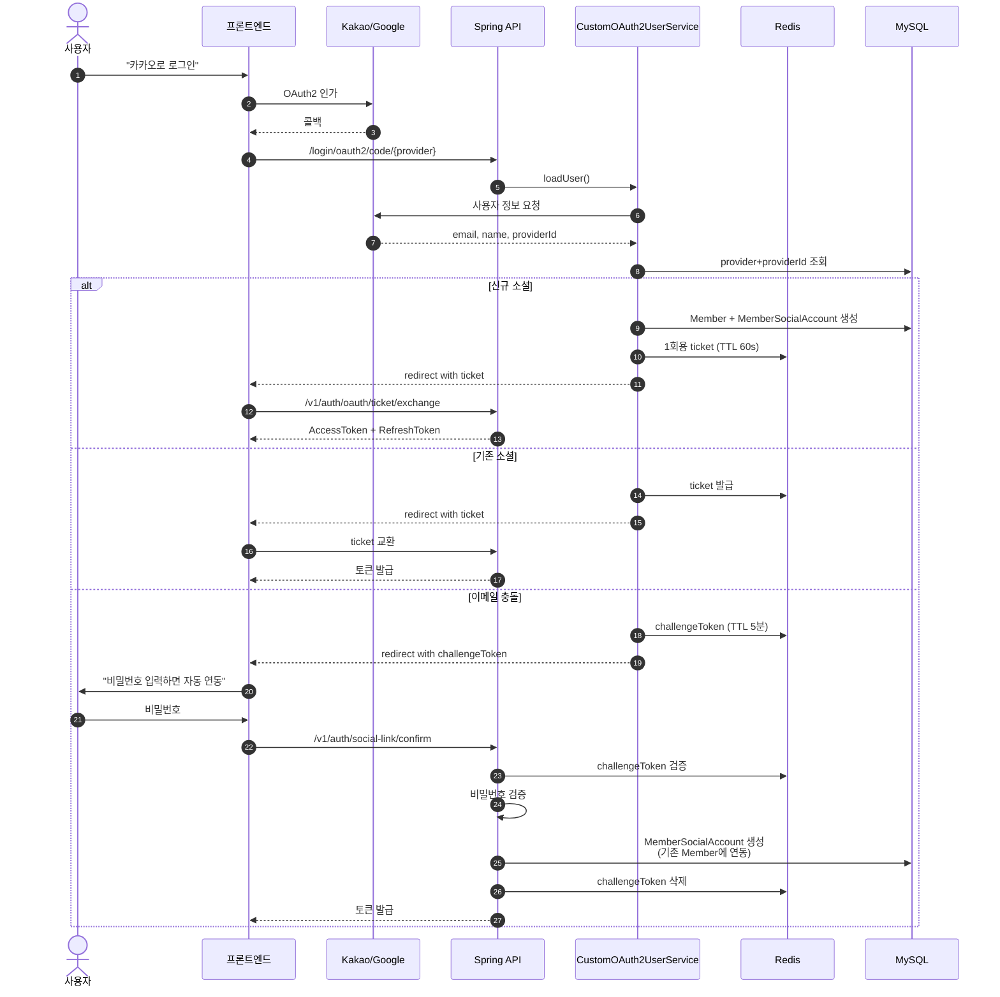
```mermaid
sequenceDiagram
    autonumber
    actor U as 사용자
    participant FE as 프론트엔드
    participant Provider as Kakao/Google
    participant API as Spring API
    participant Service as CustomOAuth2UserService
    participant Redis as Redis
    participant DB as MySQL

    U->>FE: "카카오로 로그인"
    FE->>Provider: OAuth2 인가
    Provider-->>FE: 콜백
    FE->>API: /login/oauth2/code/{provider}
    API->>Service: loadUser()
    Service->>Provider: 사용자 정보 요청
    Provider-->>Service: email, name, providerId

    Service->>DB: provider+providerId 조회

    alt 신규 소셜
        Service->>DB: Member + MemberSocialAccount 생성
        Service->>Redis: 1회용 ticket (TTL 60s)
        Service-->>FE: redirect with ticket
        FE->>API: /v1/auth/oauth/ticket/exchange
        API-->>FE: AccessToken + RefreshToken
    else 기존 소셜
        Service->>Redis: ticket 발급
        Service-->>FE: redirect with ticket
        FE->>API: ticket 교환
        API-->>FE: 토큰 발급
    else 이메일 충돌
        Service->>Redis: challengeToken (TTL 5분)
        Service-->>FE: redirect with challengeToken
        FE->>U: "비밀번호 입력하면 자동 연동"
        U->>FE: 비밀번호
        FE->>API: /v1/auth/social-link/confirm
        API->>Redis: challengeToken 검증
        API->>API: 비밀번호 검증
        API->>DB: MemberSocialAccount 생성<br/>(기존 Member에 연동)
        API->>Redis: challengeToken 삭제
        API-->>FE: 토큰 발급
    end
```

---

## 9. 강사 전환 신청

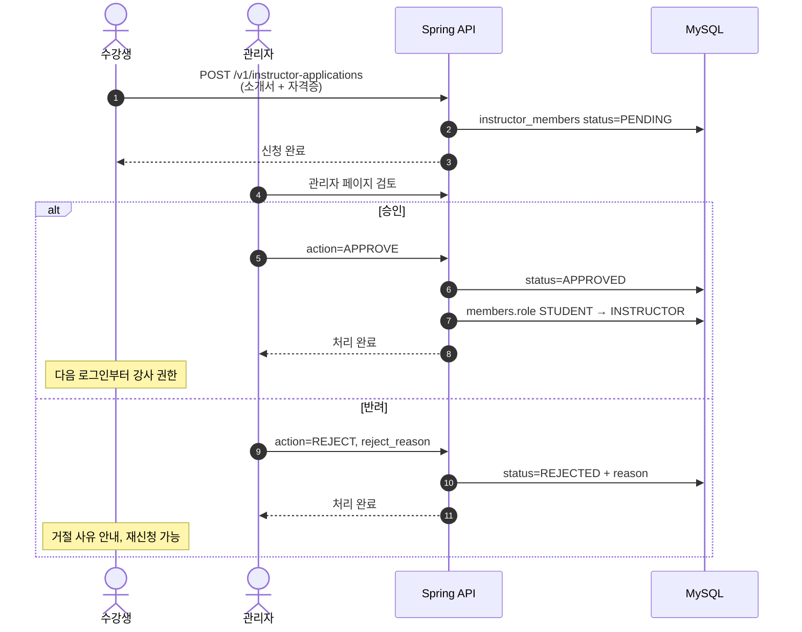
```mermaid
sequenceDiagram
    autonumber
    actor S as 수강생
    actor A as 관리자
    participant API as Spring API
    participant DB as MySQL

    S->>API: POST /v1/instructor-applications<br/>(소개서 + 자격증)
    API->>DB: instructor_members status=PENDING
    API-->>S: 신청 완료

    A->>API: 관리자 페이지 검토
    alt 승인
        A->>API: action=APPROVE
        API->>DB: status=APPROVED
        API->>DB: members.role STUDENT → INSTRUCTOR
        API-->>A: 처리 완료
        Note over S: 다음 로그인부터 강사 권한
    else 반려
        A->>API: action=REJECT, reject_reason
        API->>DB: status=REJECTED + reason
        API-->>A: 처리 완료
        Note over S: 거절 사유 안내, 재신청 가능
    end
```

---

## 10. 주문 생성 + 대기열

좌석을 차지하는 핵심 흐름입니다. Redis 분산 락 + 원자적 좌석 차감 + 대기열로 경쟁 상황을 처리합니다.

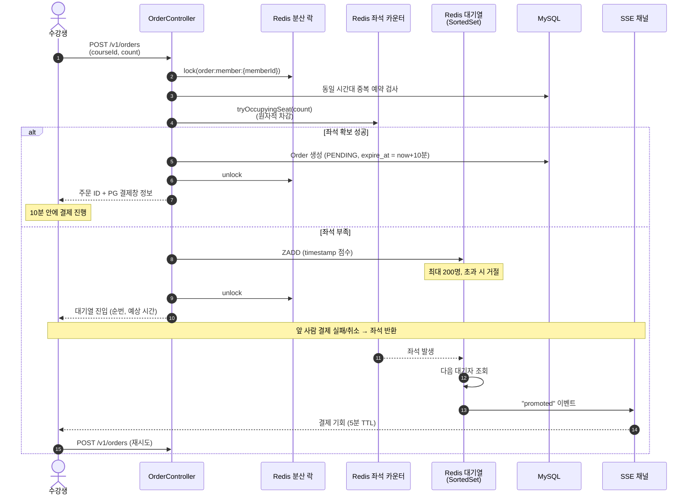
```mermaid
sequenceDiagram
    autonumber
    actor S as 수강생
    participant API as OrderController
    participant Lock as Redis 분산 락
    participant Cap as Redis 좌석 카운터
    participant Wait as Redis 대기열<br/>(SortedSet)
    participant DB as MySQL
    participant SSE as SSE 채널

    S->>API: POST /v1/orders<br/>(courseId, count)
    API->>Lock: lock(order:member:{memberId})
    API->>DB: 동일 시간대 중복 예약 검사
    API->>Cap: tryOccupyingSeat(count)<br/>(원자적 차감)

    alt 좌석 확보 성공
        API->>DB: Order 생성 (PENDING, expire_at = now+10분)
        API->>Lock: unlock
        API-->>S: 주문 ID + PG 결제창 정보
        Note over S: 10분 안에 결제 진행
    else 좌석 부족
        API->>Wait: ZADD (timestamp 점수)
        Note over Wait: 최대 200명, 초과 시 거절
        API->>Lock: unlock
        API-->>S: 대기열 진입 (순번, 예상 시간)

        Note over S,SSE: 앞 사람 결제 실패/취소 → 좌석 반환
        Cap-->>Wait: 좌석 발생
        Wait->>Wait: 다음 대기자 조회
        Wait->>SSE: "promoted" 이벤트
        SSE-->>S: 결제 기회 (5분 TTL)
        S->>API: POST /v1/orders (재시도)
    end
```

핵심 포인트:
- **분산 락 (`order:member:{memberId}`)**: 같은 회원의 동시 중복 주문 차단
- **원자적 좌석 차감**: Redis Lua 스크립트로 race condition 방지
- **대기열 SortedSet**: timestamp를 score로 사용해 FIFO 보장
- **SSE 승격**: 좌석 발생 시 다음 대기자에게 실시간 알림

---

## 11. 결제 + PortOne 웹훅

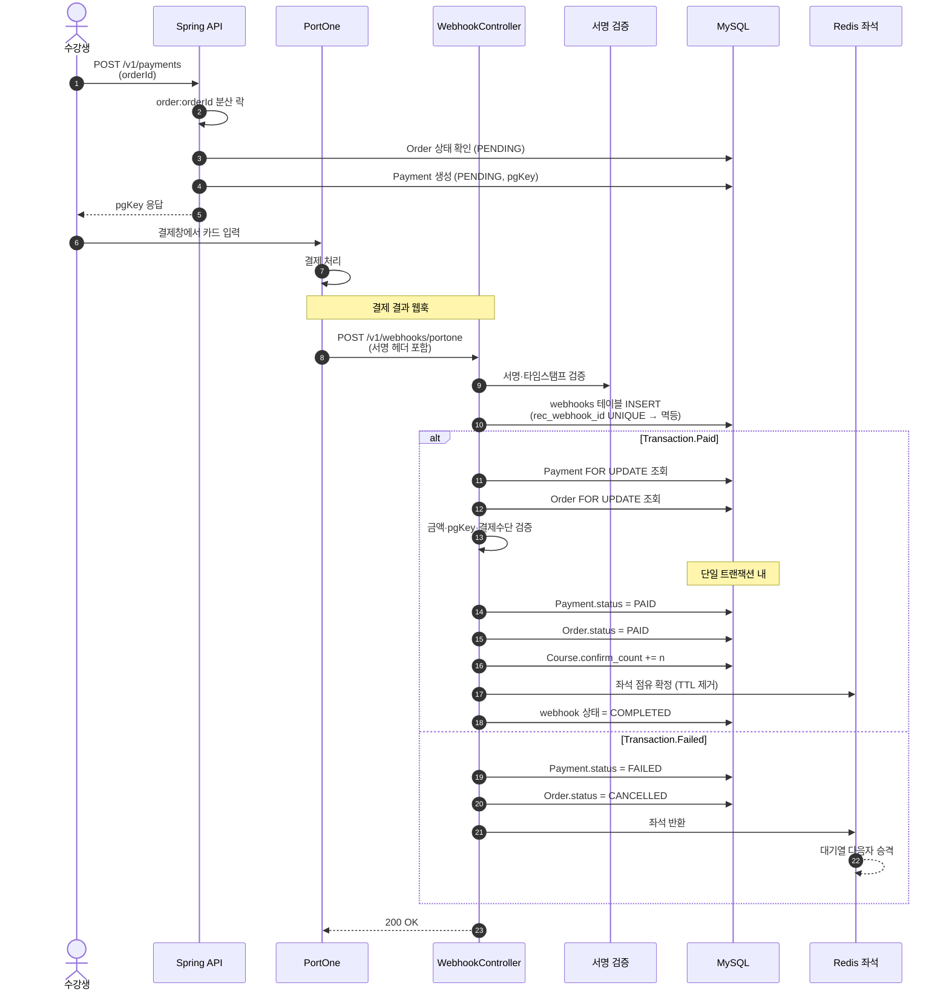
```mermaid
sequenceDiagram
    autonumber
    actor S as 수강생
    participant API as Spring API
    participant PortOne as PortOne
    participant Webhook as WebhookController
    participant Verifier as 서명 검증
    participant DB as MySQL
    participant Cap as Redis 좌석

    S->>API: POST /v1/payments<br/>(orderId)
    API->>API: order:orderId 분산 락
    API->>DB: Order 상태 확인 (PENDING)
    API->>DB: Payment 생성 (PENDING, pgKey)
    API-->>S: pgKey 응답

    S->>PortOne: 결제창에서 카드 입력
    PortOne->>PortOne: 결제 처리

    Note over PortOne,Webhook: 결제 결과 웹훅
    PortOne->>Webhook: POST /v1/webhooks/portone<br/>(서명 헤더 포함)
    Webhook->>Verifier: 서명·타임스탬프 검증
    Webhook->>DB: webhooks 테이블 INSERT<br/>(rec_webhook_id UNIQUE → 멱등)

    alt Transaction.Paid
        Webhook->>DB: Payment FOR UPDATE 조회
        Webhook->>DB: Order FOR UPDATE 조회
        Webhook->>Webhook: 금액·pgKey·결제수단 검증
        Note over DB: 단일 트랜잭션 내
        Webhook->>DB: Payment.status = PAID
        Webhook->>DB: Order.status = PAID
        Webhook->>DB: Course.confirm_count += n
        Webhook->>Cap: 좌석 점유 확정 (TTL 제거)
        Webhook->>DB: webhook 상태 = COMPLETED
    else Transaction.Failed
        Webhook->>DB: Payment.status = FAILED
        Webhook->>DB: Order.status = CANCELLED
        Webhook->>Cap: 좌석 반환
        Cap-->>Cap: 대기열 다음자 승격
    end

    Webhook-->>PortOne: 200 OK
```

핵심 포인트:
- **웹훅 멱등성**: `rec_webhook_id` UNIQUE 제약으로 중복 수신 차단
- **이중 FOR UPDATE 락**: Payment + Order 동시 잠금으로 race 방지
- **단일 트랜잭션 보장**: payment / order / course 세 테이블이 원자적으로 변경
- **금액 재검증**: PortOne이 보낸 금액과 DB 주문 금액이 다르면 거절

---

## 12. 환불 — 수강생 직접 신청

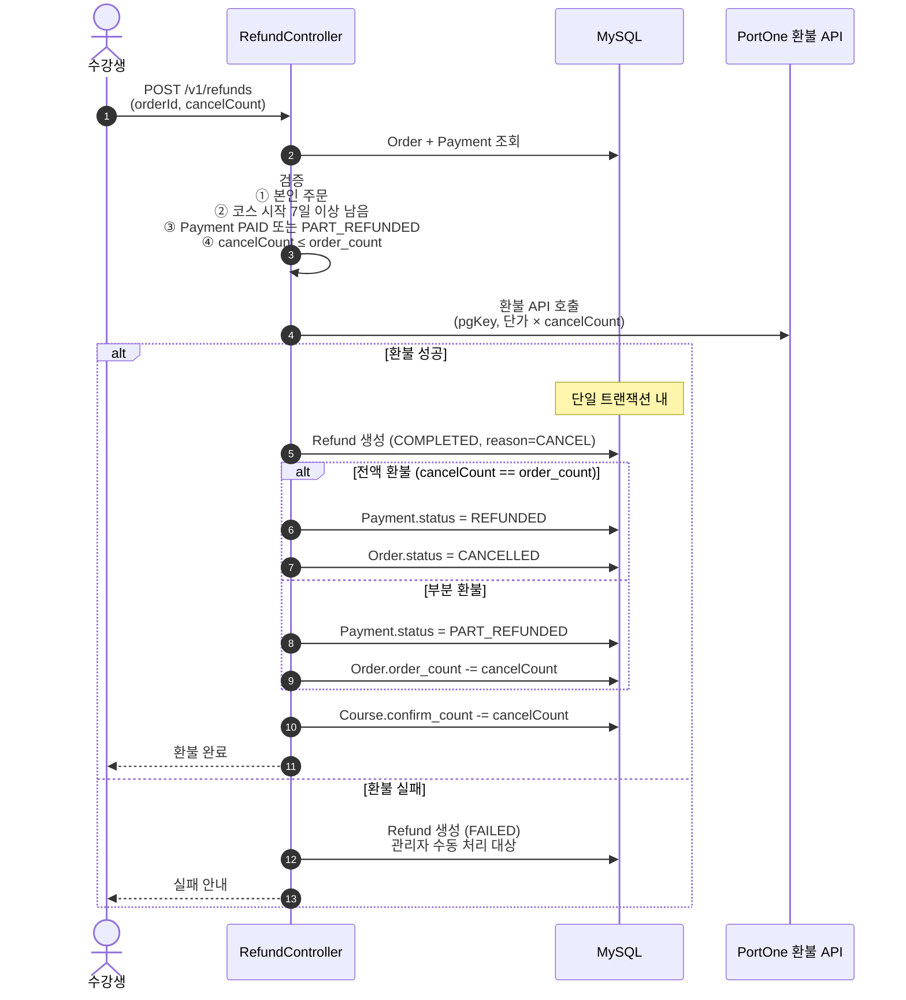
```mermaid
sequenceDiagram
    autonumber
    actor S as 수강생
    participant API as RefundController
    participant DB as MySQL
    participant PortOne as PortOne 환불 API

    S->>API: POST /v1/refunds<br/>(orderId, cancelCount)
    API->>DB: Order + Payment 조회
    API->>API: 검증<br/>① 본인 주문<br/>② 코스 시작 7일 이상 남음<br/>③ Payment PAID 또는 PART_REFUNDED<br/>④ cancelCount ≤ order_count

    API->>PortOne: 환불 API 호출<br/>(pgKey, 단가 × cancelCount)

    alt 환불 성공
        Note over DB: 단일 트랜잭션 내
        API->>DB: Refund 생성 (COMPLETED, reason=CANCEL)
        alt 전액 환불 (cancelCount == order_count)
            API->>DB: Payment.status = REFUNDED
            API->>DB: Order.status = CANCELLED
        else 부분 환불
            API->>DB: Payment.status = PART_REFUNDED
            API->>DB: Order.order_count -= cancelCount
        end
        API->>DB: Course.confirm_count -= cancelCount
        API-->>S: 환불 완료
    else 환불 실패
        API->>DB: Refund 생성 (FAILED)<br/>관리자 수동 처리 대상
        API-->>S: 실패 안내
    end
```

---

## 13. 환불 — 강사 코스 취소 자동 환불 (Outbox + Batch)

강사가 코스를 취소하면 즉시 PG에 일괄 환불을 호출하지 않고, **Outbox 패턴 + Spring Batch**로 안전하게 비동기 처리합니다.

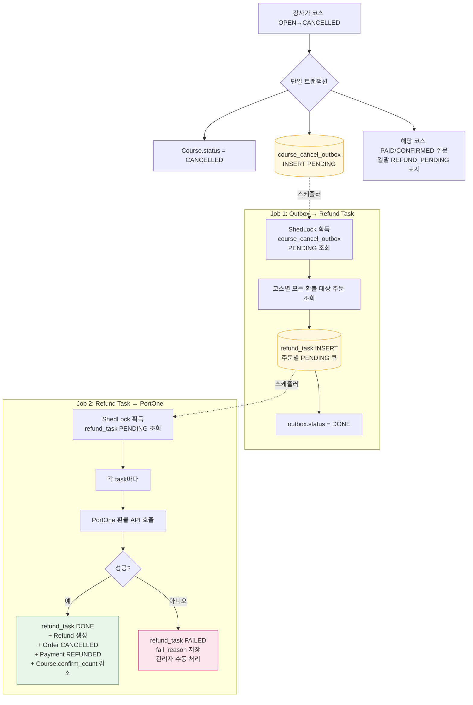
```mermaid
flowchart TD
    Cancel[강사가 코스 OPEN→CANCELLED] --> Tx{단일 트랜잭션}
    Tx --> CourseStat[Course.status = CANCELLED]
    Tx --> Outbox[(course_cancel_outbox<br/>INSERT PENDING)]
    Tx --> Mark[해당 코스 PAID/CONFIRMED 주문<br/>일괄 REFUND_PENDING 표시]

    Outbox -.스케줄러.-> Job1

    subgraph Job1Block [Job 1: Outbox → Refund Task]
        Job1[ShedLock 획득<br/>course_cancel_outbox<br/>PENDING 조회]
        Job1 --> Loop1[코스별 모든 환불 대상 주문 조회]
        Loop1 --> Insert[(refund_task INSERT<br/>주문별 PENDING 큐)]
        Insert --> MarkDone[outbox.status = DONE]
    end

    Insert -.스케줄러.-> Job2

    subgraph Job2Block [Job 2: Refund Task → PortOne]
        Job2[ShedLock 획득<br/>refund_task PENDING 조회]
        Job2 --> Each[각 task마다]
        Each --> Call[PortOne 환불 API 호출]
        Call --> OK{성공?}
        OK -->|예| Done[refund_task DONE<br/>+ Refund 생성<br/>+ Order CANCELLED<br/>+ Payment REFUNDED<br/>+ Course.confirm_count 감소]
        OK -->|아니오| Fail[refund_task FAILED<br/>fail_reason 저장<br/>관리자 수동 처리]
    end

    style Outbox fill:#fff8e1,stroke:#f9a825
    style Insert fill:#fff8e1,stroke:#f9a825
    style Done fill:#e6f4ea,stroke:#137333
    style Fail fill:#fce4ec,stroke:#c2185b
```

핵심 설계:
- **Outbox 패턴**: 코스 취소와 환불 작업 큐 적재가 **하나의 트랜잭션**에 묶여 데이터 정합성 보장
- **두 단계 Batch 분리**: Job1(이벤트 → 작업 큐), Job2(작업 큐 → PG API). 단계마다 ShedLock으로 중복 실행 방지
- **개별 실패 허용**: 한 주문 환불이 실패해도 다른 주문은 계속 처리. 실패는 별도 trail로 남아 운영자가 수동 처리
- **사유 기록**: `reason = INSTRUCTOR` (관리자 강제 취소도 강사 귀책으로 동일 분류)

---

## 14. 출석 — QR 생성·스캔·SSE

강사가 QR을 만들면 수강생이 1회용 토큰으로 출석 처리하고, 강사 화면에는 SSE로 실시간 반영됩니다.

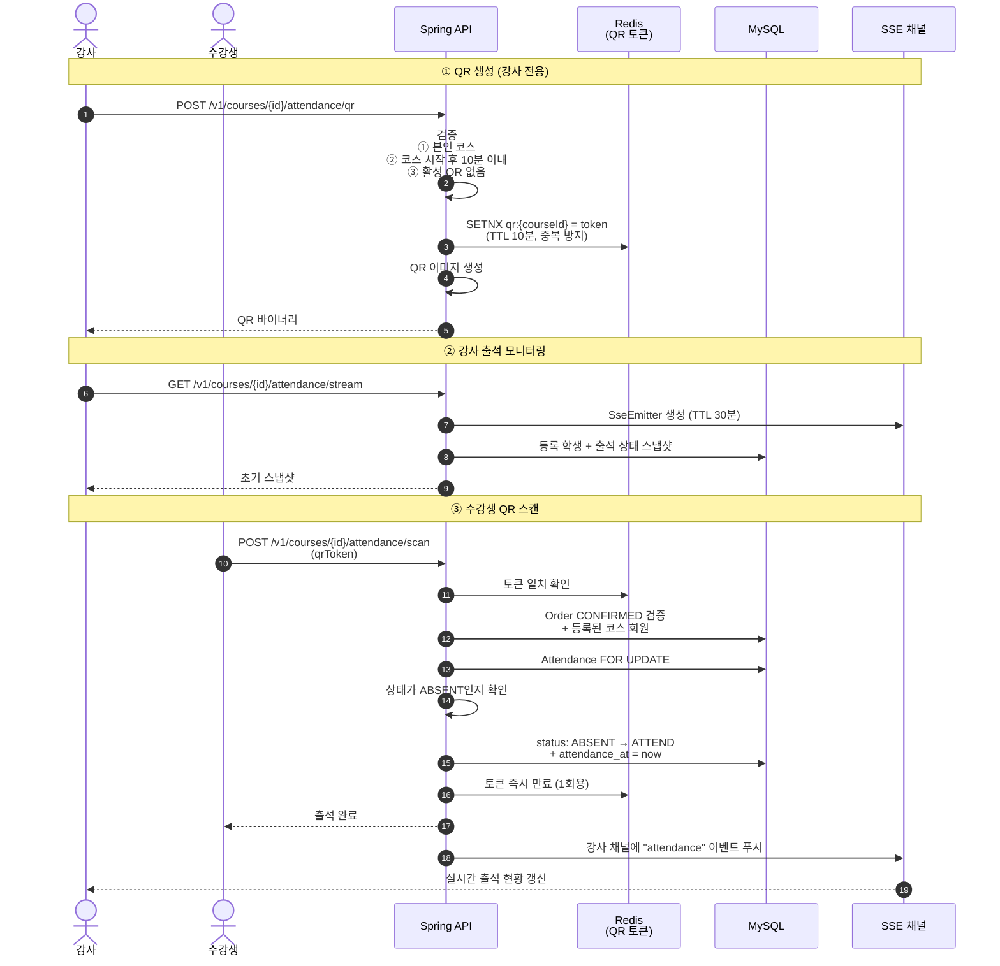
```mermaid
sequenceDiagram
    autonumber
    actor I as 강사
    actor S as 수강생
    participant API as Spring API
    participant Redis as Redis<br/>(QR 토큰)
    participant DB as MySQL
    participant SSE as SSE 채널

    Note over I,SSE: ① QR 생성 (강사 전용)
    I->>API: POST /v1/courses/{id}/attendance/qr
    API->>API: 검증<br/>① 본인 코스<br/>② 코스 시작 후 10분 이내<br/>③ 활성 QR 없음
    API->>Redis: SETNX qr:{courseId} = token<br/>(TTL 10분, 중복 방지)
    API->>API: QR 이미지 생성
    API-->>I: QR 바이너리

    Note over I,SSE: ② 강사 출석 모니터링
    I->>API: GET /v1/courses/{id}/attendance/stream
    API->>SSE: SseEmitter 생성 (TTL 30분)
    API->>DB: 등록 학생 + 출석 상태 스냅샷
    API-->>I: 초기 스냅샷

    Note over I,SSE: ③ 수강생 QR 스캔
    S->>API: POST /v1/courses/{id}/attendance/scan<br/>(qrToken)
    API->>Redis: 토큰 일치 확인
    API->>DB: Order CONFIRMED 검증<br/>+ 등록된 코스 회원
    API->>DB: Attendance FOR UPDATE
    API->>API: 상태가 ABSENT인지 확인
    API->>DB: status: ABSENT → ATTEND<br/>+ attendance_at = now
    API->>Redis: 토큰 즉시 만료 (1회용)
    API-->>S: 출석 완료

    API->>SSE: 강사 채널에 "attendance" 이벤트 푸시
    SSE-->>I: 실시간 출석 현황 갱신
```

핵심 포인트:
- **SETNX로 QR 중복 방지**: 동시에 같은 코스에 두 개의 QR이 활성화되지 않도록 원자 연산 사용
- **1회용 토큰**: 스캔 즉시 Redis에서 삭제 → 재사용 불가
- **FOR UPDATE 락**: 동일 학생의 동시 스캔 시도에서 중복 출석 방지
- **SSE 실시간 푸시**: 강사 화면이 폴링 없이 즉시 갱신

---

## 15. 후기 + AI 요약

후기 작성 조건이 까다롭고(CONFIRMED + 코스 종료 + 출석), 작성될 때마다 AI 요약이 누적 갱신됩니다. 누적 왜곡을 막기 위해 매일 새벽 배치로 전체 재요약합니다.

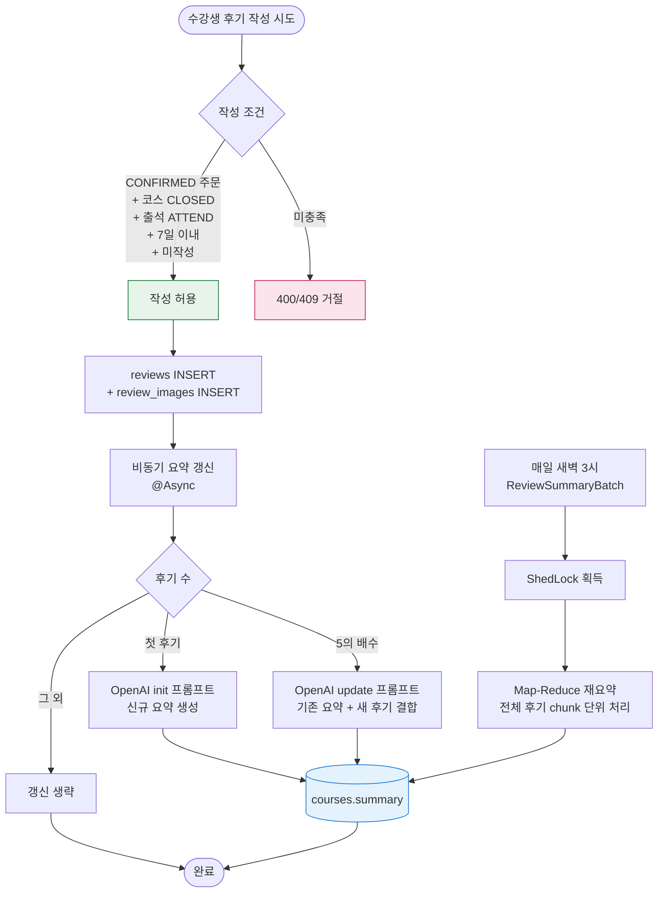
```mermaid
flowchart TD
    Start([수강생 후기 작성 시도]) --> Check{작성 조건}
    Check -->|CONFIRMED 주문<br/>+ 코스 CLOSED<br/>+ 출석 ATTEND<br/>+ 7일 이내<br/>+ 미작성| Allow[작성 허용]
    Check -->|미충족| Reject[400/409 거절]

    Allow --> Save[reviews INSERT<br/>+ review_images INSERT]
    Save --> Async[비동기 요약 갱신<br/>@Async]

    Async --> Count{후기 수}
    Count -->|첫 후기| Init[OpenAI init 프롬프트<br/>신규 요약 생성]
    Count -->|5의 배수| Update[OpenAI update 프롬프트<br/>기존 요약 + 새 후기 결합]
    Count -->|그 외| Skip[갱신 생략]

    Init --> WriteSummary[(courses.summary)]
    Update --> WriteSummary
    Skip --> End

    WriteSummary --> End([완료])

    Nightly[매일 새벽 3시<br/>ReviewSummaryBatch] --> ShedLock[ShedLock 획득]
    ShedLock --> Reaggregate[Map-Reduce 재요약<br/>전체 후기 chunk 단위 처리]
    Reaggregate --> WriteSummary

    style Allow fill:#e6f4ea,stroke:#137333
    style Reject fill:#fce4ec,stroke:#c2185b
    style WriteSummary fill:#e3f2fd,stroke:#1976d2
```

핵심 포인트:
- **누적 갱신 + 주기적 보정**: 매번 LLM 호출하면 비용·지연 폭발 → 5의 배수마다 갱신, 매일 새벽 정확도 보정
- **@Async**: 후기 저장과 LLM 호출을 분리해 사용자 응답 지연 0
- **Map-Reduce**: 후기 100개 단위 chunk 요약 → 최종 요약. 토큰 한계 회피 + 병렬화 가능

---

## 16. 챗봇 RAG (적재 + 질의)

### 16-1. 부팅 시 적재

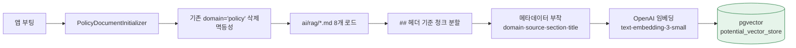
```mermaid
flowchart LR
    A[앱 부팅] --> B[PolicyDocumentInitializer]
    B --> C[기존 domain='policy' 삭제<br/>멱등성]
    C --> D[ai/rag/*.md 8개 로드]
    D --> E[## 헤더 기준 청크 분할]
    E --> F[메타데이터 부착<br/>domain·source·section·title]
    F --> G[OpenAI 임베딩<br/>text-embedding-3-small]
    G --> H[(pgvector<br/>potential_vector_store)]

    style H fill:#e6f4ea,stroke:#137333
```

### 16-2. 질문 시 응답

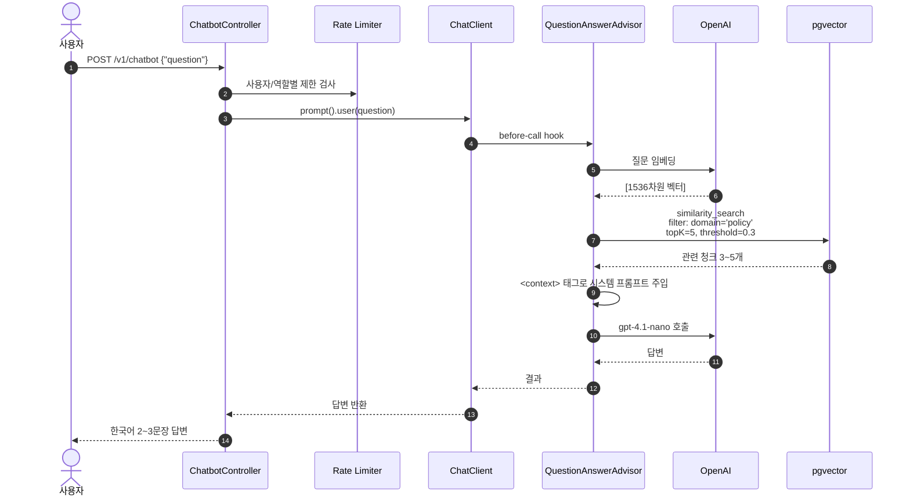
```mermaid
sequenceDiagram
    autonumber
    actor U as 사용자
    participant API as ChatbotController
    participant Limiter as Rate Limiter
    participant Client as ChatClient
    participant Advisor as QuestionAnswerAdvisor
    participant OpenAI as OpenAI
    participant Vector as pgvector

    U->>API: POST /v1/chatbot {"question"}
    API->>Limiter: 사용자/역할별 제한 검사
    API->>Client: prompt().user(question)
    Client->>Advisor: before-call hook
    Advisor->>OpenAI: 질문 임베딩
    OpenAI-->>Advisor: [1536차원 벡터]
    Advisor->>Vector: similarity_search<br/>filter: domain='policy'<br/>topK=5, threshold=0.3
    Vector-->>Advisor: 관련 청크 3~5개
    Advisor->>Advisor: <context> 태그로 시스템 프롬프트 주입
    Advisor->>OpenAI: gpt-4.1-nano 호출
    OpenAI-->>Advisor: 답변
    Advisor-->>Client: 결과
    Client-->>API: 답변 반환
    API-->>U: 한국어 2~3문장 답변
```

---

## 17. 시스템 스케줄러 요약

전체 배치/스케줄러를 한눈에 본 표입니다.

| 스케줄러 | 주기 | 분산 제어 | 역할 | 영향 도메인 |
|---|---|---|---|---|
| **OrderExpirationScheduler** | 1분 | Redisson 분산 락 | 10분 만료된 PENDING → EXPIRED 전환, 좌석 반환, 대기열 승격 | 주문, 대기열 |
| **OrderConfirmationScheduler** | 매일 00:10 | Redisson 분산 락 | 환불 마감 7일 경과한 PAID → CONFIRMED 전환 | 주문 |
| **CourseCancelOutbox Job** | 별도 주기 / 트리거 | ShedLock | 강사 코스 취소 이벤트를 환불 작업 큐로 전개 | 코스, 환불 |
| **RefundTask Job** | 별도 주기 / 트리거 | ShedLock | 환불 작업 큐를 읽어 PortOne 환불 API 호출 | 결제, 환불 |
| **ReviewSummaryBatchJob** | 매일 새벽 3시 | ShedLock | 누적 갱신 왜곡 보정용 전체 재요약 | 후기 |

분산 락 도구 차이:
- **Redisson `RLock`** — 짧은 임계 구역 보호용. tryLock 후 즉시 획득 못 하면 다음 인스턴스에 양보
- **ShedLock** — 긴 배치 잡 보호용. 잡 시작 시 락 획득, `lockAtMostFor`로 최대 점유 시간 제한 (장애 시 자동 해제)

---

## 부록: 다이어그램 한 줄 요약

| 번호 | 다이어그램 | 핵심 |
|---|---|---|
| 1 | 전체 사용자 여정 | 가입 → 수강 → 출석 → 후기까지 한 장 |
| 2 | 도메인 의존 관계도 | 모든 도메인 + 인프라 + 외부 서비스 |
| 3 | 회원 상태 머신 | ACTIVE ↔ SUSPENDED → WITHDRAWAL |
| 4 | 코스 상태 머신 | PREPARATION ↔ REJECTED → OPEN → CLOSED/CANCELLED |
| 5 | 주문 상태 머신 | PENDING → PAID → CONFIRMED, EXPIRED, CANCELLED |
| 6 | 결제 상태 머신 | PENDING → PAID → PART_REFUNDED → REFUNDED, FAILED |
| 7 | 인증 토큰 흐름 | JWT 발급·갱신·블랙리스트 |
| 8 | 소셜 로그인 + 충돌 | 비밀번호 챌린지 자동 연동 |
| 9 | 강사 전환 신청 | PENDING → APPROVED/REJECTED |
| 10 | 주문 + 대기열 | 분산 락 + 원자적 좌석 차감 + SSE 승격 |
| 11 | 결제 + 웹훅 | 멱등성 + 이중 FOR UPDATE + 단일 트랜잭션 |
| 12 | 환불 (수강생) | 7일 검증 + 부분/전액 분기 |
| 13 | 환불 (강사 취소) | Outbox + 두 단계 Batch |
| 14 | 출석 + SSE | SETNX QR + 1회용 토큰 + 실시간 푸시 |
| 15 | 후기 + AI 요약 | 누적 갱신 + 매일 보정 |
| 16 | 챗봇 RAG | pgvector + 시스템 프롬프트 락다운 |
| 17 | 스케줄러 요약 | Redisson + ShedLock 두 종류 분산 제어 |
